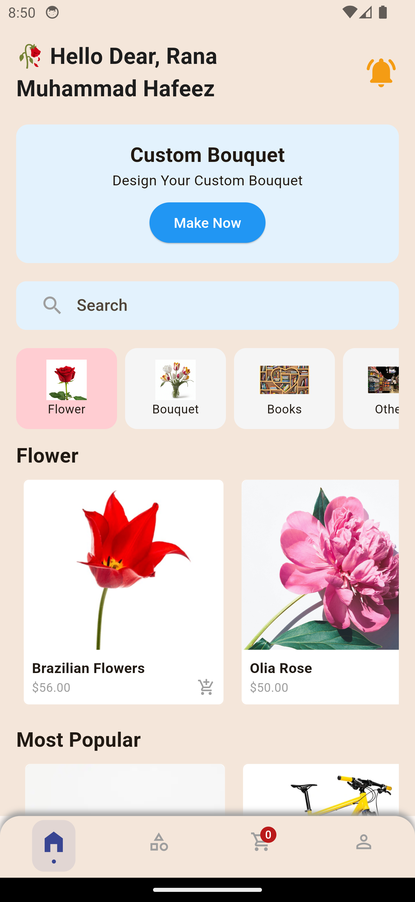
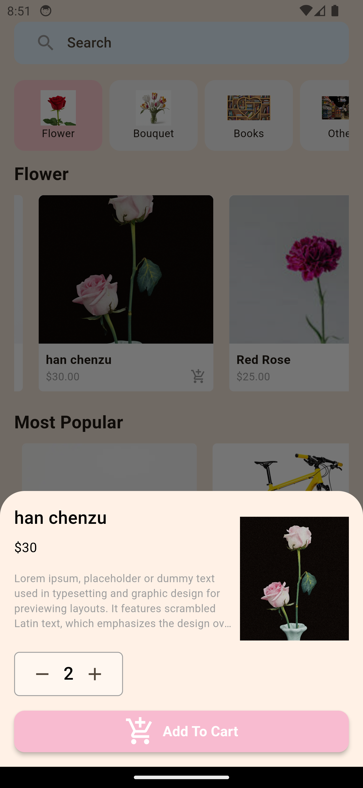
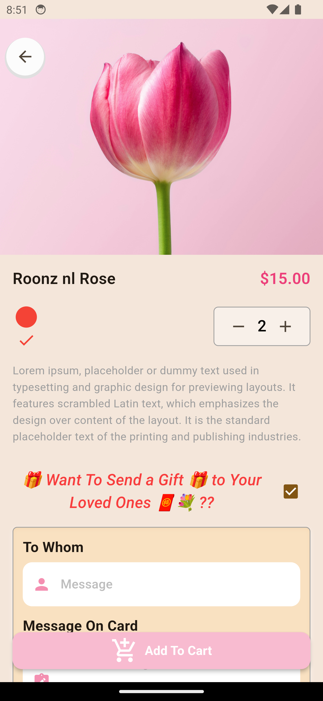
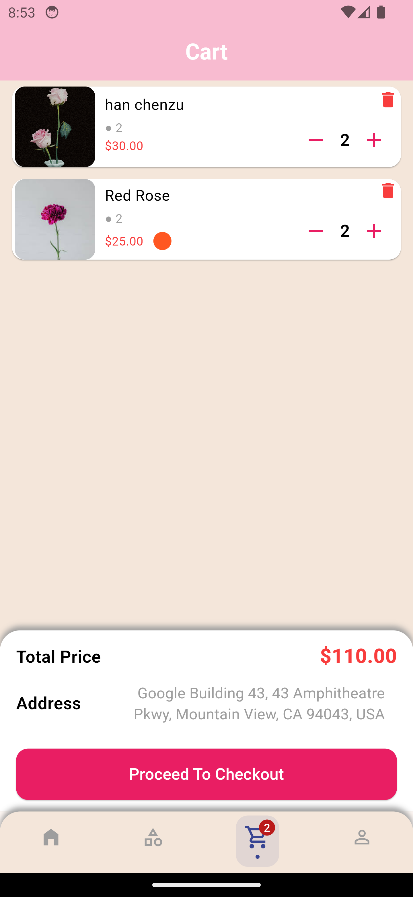

# 🌸 Flower Shop - Flutter E-Commerce App

Flower Shop is a **beautiful and modern e-commerce UI** built with Flutter. This app allows users to explore a variety of flowers, create custom bouquets, manage their cart, and place orders seamlessly.


---

## 📽️ Demo Video
🎥 **Watch the live demo here:** [Flower Shop Demo](https://web.facebook.com/share/r/164922r1XZ/)

---

## 🚀 Features
✅ **User Authentication** (Signup/Login with Supabase)  
✅ **Product Listing** (Flowers, Bouquets, Others)  
✅ **Custom Bouquet Builder** (Choose colors, ribbons, and flowers)  
✅ **Cart & Order Management**  
✅ **User Account Screen**  
✅ **Language Localisation (Multi-language support)**  
✅ **Push Notifications** for order updates

---

## 🛠️ Tech Stack
- **Flutter** (Dart) - UI Framework
- **Riverpod** - State Management
- **Supabase** - Backend & Database
- **Clean Architecture** - Scalable & Maintainable Code

---

## 📸 Screenshots
| Home Screen | Product Listing | Product Detail View | Cart Screen |
|------------|----------------|------------------------|-------------|
|  |  |  |  |


---

## 🔹 Getting Started

### **1️⃣ Clone the Repository**
```sh
git clone https://github.com/hafeezrana/Flower-Shop.git
cd Flower-Shop
```

### **2️⃣ Install Dependencies**
```sh
flutter pub get
```

### **3️⃣ Setup Supabase**
To run the app, you need to set up your **Supabase URL & API Key**.

📌 **Follow these steps:**
1. Create a **`lib/utils/key_consts.dart`** file in the project.
2. Add your Supabase credentials:


3. Replace **`YOUR_SUPABASE_URL`** and **`YOUR_SUPABASE_ANON_KEY`** with your actual Supabase credentials in key_const.dart file.

---

### **4️⃣ Run the App**
```sh
flutter run
```

---

## 📌 Future Enhancements
- 🛍️ **Online Payments** for seamless checkout
- 🚀 **AI-based bouquet recommendations**
- 📦 **Order Tracking System**

---

## ❓ Need Help?
For **Supabase database schema** or any other queries, feel free to **inbox me**.

---

## 🌐 More Information
For more details, visit: **[hafeezrana.com](https://hafeezrana.com)**

---

## 📄 License
This project is **open-source** and available under the [MIT License](LICENSE).

---

### 🚀 **Happy Coding & Shopping!** 🌸
```